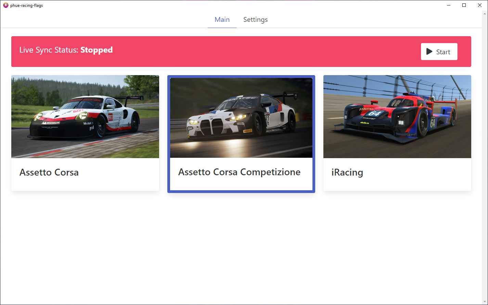
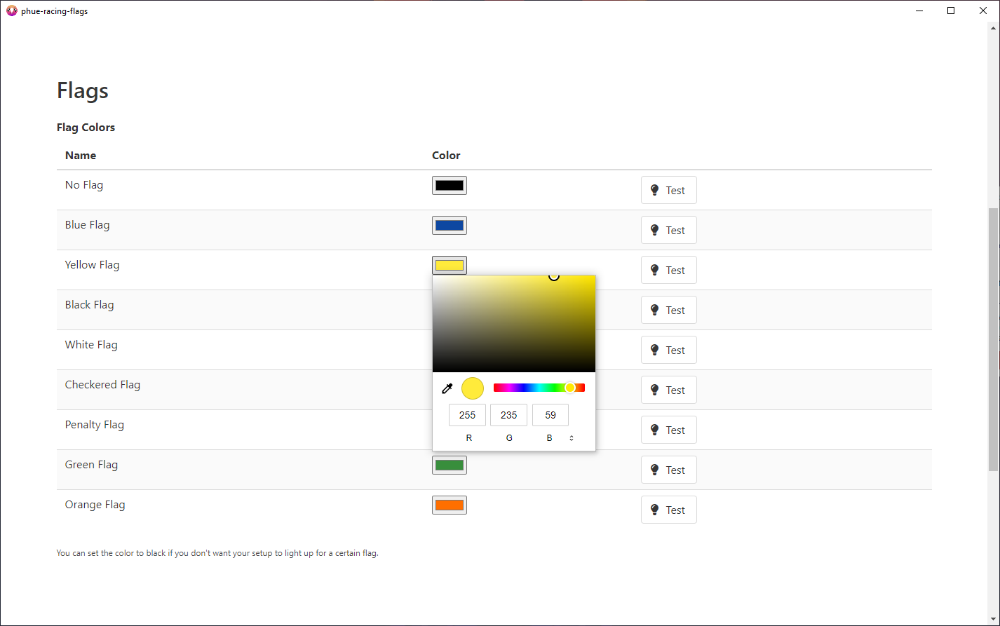

[![Forks][forks-shield]][forks-url]
[![Stargazers][stars-shield]][stars-url]
[![Issues][issues-shield]][issues-url]
[![MIT License][license-shield]][license-url]

<!-- PROJECT LOGO -->
<br />
<p align="center">
  <a href="https://github.com/TUnbehaun/phue-racing-flags">
    
  </a>

  <h3 align="center">phue-racing-flags</h3>

  <p align="center">
    Use your Philips Hue lights as Racing Flags.
    <br />
    <br />
    <a href="https://github.com/TUnbehaun/phue-racing-flags"><strong>Explore the docs »</strong></a>
    <br />
    <br />
    <a href="https://github.com/TUnbehaun/phue-racing-flags/issues">Report Bug</a>
    ·
    <a href="https://github.com/TUnbehaun/phue-racing-flags/issues">Request Feature</a>
    <br />
    <br />
  </p>
</p>

<!-- TABLE OF CONTENTS -->
<details open="open">
  <summary><h2 style="display: inline-block">Table of Contents</h2></summary>
  <ol>
    <li>
      <a href="#about-the-project">About The Project</a>
      <ul>
        <li><a href="#built-with">Built With</a></li>
      </ul>
    </li>
    <li><a href="#supported-systems-and-racing-simulations">Supported Systems and Racing Simulations</a></li>
    <li>
      <a href="#local-development">Local Development</a>
      <ul>
        <li><a href="#prerequisites">Prerequisites</a></li>
        <li><a href="#installation">Installation</a></li><li>
        <a href="#run-the-app">Run the app</a></li>
      </ul>
    </li>
    <li><a href="#usage">Usage</a></li>
    <li><a href="#license">License</a></li>
    <li><a href="#contact">Contact</a></li>
    <li><a href="#acknowledgements">Acknowledgements</a></li>
    <li><a href="#disclaimer">Disclaimer</a></li>
  </ol>
</details>

<!-- ABOUT THE PROJECT -->
## About The Project




One Friday evening I thought to myself that it would be pretty cool to use my Philips Hue lights as indicators for the racing flags inside of Assetto Corsa Competizione. As no app was available to achieve this, I decided to take matters into my own hands and create one.

### Built With

* [Python](https://www.python.org/)
* [Electron](https://www.electronjs.org/)
* [Vue.js](https://vuejs.org/)

## Supported Systems and Racing Simulations

The app is designed for Windows and currently supports the following racing simulations:
* [Assetto Corsa](https://www.assettocorsa.it/home-ac/)
* [Assetto Corsa Competizione](https://www.assettocorsa.it/competizione/)
* [iRacing](https://www.iracing.com/)

<!-- GETTING STARTED -->
## Local Development

To get a local development copy up and running, follow these simple steps.

### Prerequisites

* [Python](https://www.python.org/downloads/)
* [Node.js / npm](https://nodejs.org/en/download/)
  

### Installation

* Clone the repo
   ```sh
   git clone https://github.com/TUnbehaun/phue-racing-flags.git
   ```

* Install Eel via pip
   ```sh
   pip install eel
   ```

* Install Electron via npm
   ```sh
   npm install
   ```

### Run the app

* Start the GUI
  ```sh
   python web.py
   ```

<!-- USAGE EXAMPLES -->
## Usage

To just use the app itself without setting up a local development copy, you can follow these simple steps:

1. Download the latest .exe file from here: https://github.com/TUnbehaun/phue-racing-flags/releases/latest/download/phue-racing-flags.exe
2. If you have already used a previous version, make sure to delete any existing phue-rf-save.json or prf-save.json files, to ensure compatibility with the newest version.
3. Run the .exe file

Once the app is started, you can use it the following way:

1. Enter the IP Address of your Philips Hue Bridge under <strong>Settings -> Philips Hue -> Bridge IP</strong>.
(You can find the IP Address of your Bridge in the interface of your Router)
2. Press the (hardware) link button on your Philips Hue Bridge and then within 30 seconds hit the "Connect" button next to the Bridge IP input field.
(Pressing the (hardware) link button on your Philips Hue Bridge is only necessary for the very first time you connect the app to a new Bridge)
3. You should be able to choose one or multiple of your lights under <strong>Settings -> Philips Hue -> Lights</strong> to use as the Racing Flag Light(s)
4. Adjust brightness if needed.
5. Custom colors for your lights can be set under <strong>Settings -> Flags -> Flag Colors</strong> respectively.
6. Test your color configuration by using the Test buttons next to each flag.
7. On the main view you can use the cards to switch syncing between Assetto Corsa, Assetto Corsa Competizione or iRacing.
8. To start syncing the Racing Flag Light(s) with your simulation's race flag click "Start" in the live sync banner.
9. To stop syncing the Racing Flag Light(s) click "Stop".

<!-- LICENSE -->
## License

Distributed under the MIT License. See `LICENSE` for more information.

<!-- CONTACT -->
## Contact

Project Link: [https://github.com/TUnbehaun/phue-racing-flags](https://github.com/TUnbehaun/phue-racing-flags)

<!-- ACKNOWLEDGEMENTS -->
## Acknowledgements

* [phue](https://github.com/studioimaginaire/phue)
* [Eel](https://github.com/ChrisKnott/Eel)
* [PyInstaller](http://www.pyinstaller.org/)
* [pyirsdk](https://github.com/kutu/pyirsdk)
* [hue-python-rgb-converter](https://github.com/benknight/hue-python-rgb-converter)

## Disclaimer

This app is not an official product endorsed by Philips, Kunos Simulazioni or iRacing and I am in no way affiliated with them. The images used in the main screen of the app are in-game screenshots from the respective simulations and I explicitly asked for permission, before I included them.

"Hue Personal Wireless Lighting" is a trademark owned by Koninklijke Philips Electronics N.V.

"Assetto Corsa" and "Assetto Corsa Competizione" are trademarks owned by Kunos Simulazioni S.r.l.

"iRacing" is a trademark owned by iRacing.com Motorsport Simulations, LLC

<!-- MARKDOWN LINKS & IMAGES -->
<!-- https://www.markdownguide.org/basic-syntax/#reference-style-links -->
[forks-shield]: https://img.shields.io/github/forks/TUnbehaun/phue-racing-flags.svg?style=for-the-badge
[forks-url]: https://github.com/TUnbehaun/phue-racing-flags/network/members
[stars-shield]: https://img.shields.io/github/stars/TUnbehaun/phue-racing-flags.svg?style=for-the-badge
[stars-url]: https://github.com/TUnbehaun/phue-racing-flags/stargazers
[issues-shield]: https://img.shields.io/github/issues/TUnbehaun/phue-racing-flags.svg?style=for-the-badge
[issues-url]: https://github.com/TUnbehaun/phue-racing-flags/issues
[license-shield]: https://img.shields.io/github/license/TUnbehaun/phue-racing-flags.svg?style=for-the-badge
[license-url]: https://github.com/TUnbehaun/phue-racing-flags/blob/master/LICENSE.txt

